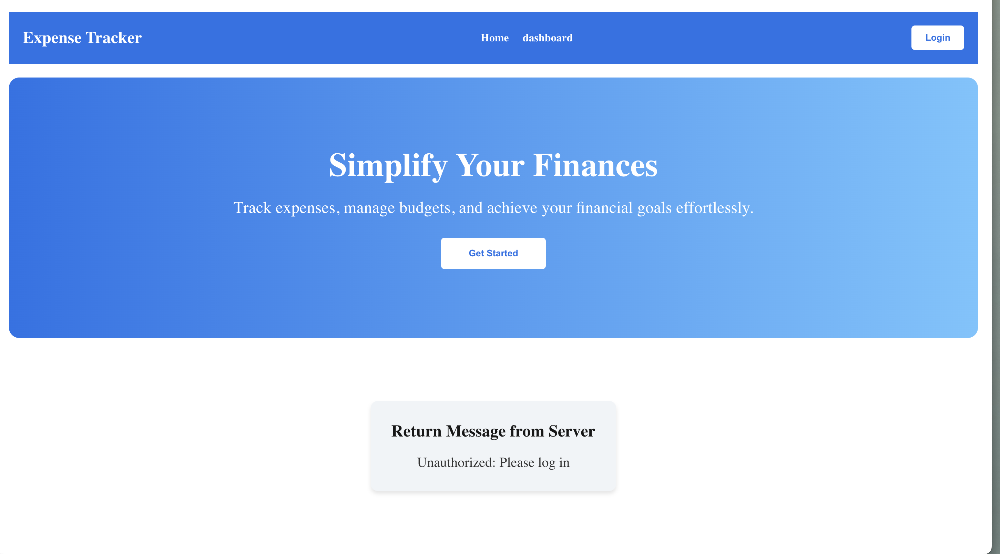
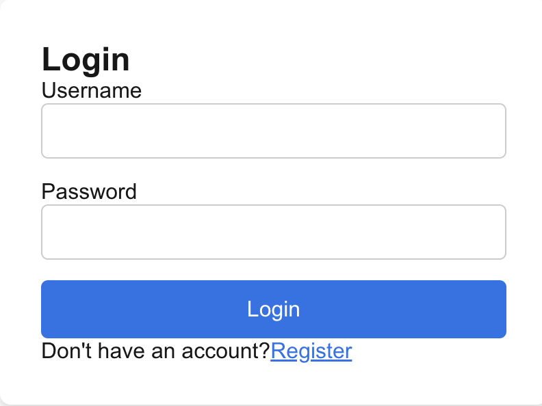
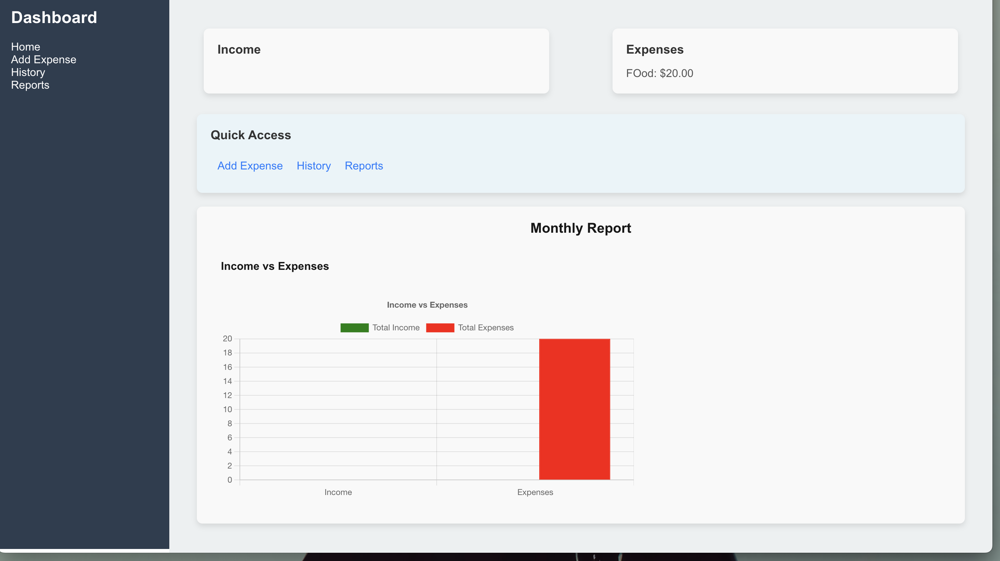
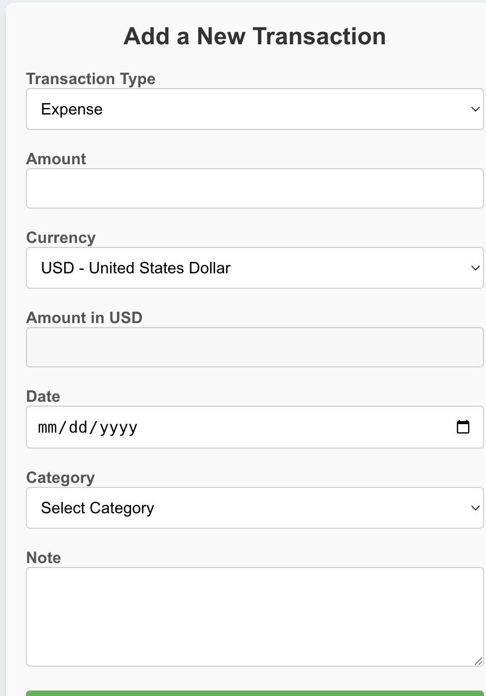

# Finance Tracker

# About

The Finance Tracker is a web application designed to help users manage their personal finances. It allows users to track their expenses and income, categorize transactions, and maintain a record of their financial activities. The platform supports features such as user authentication, transaction categorization, and detailed financial analysis.

The system consists of a client-side (front-end) and server-side (back-end) application. The front-end is built with modern JavaScript technologies, while the back-end is powered by Node.js and PostgreSQL for database management.

### Currency Exchange API

For handling currency conversions, the Finance Tracker integrates with the **ExchangeRate API** (https://app.exchangerate-api.com/activate-account). This API provides real-time exchange rates for over 170 currencies.

When a user records an income or transaction in a foreign currency, the application converts the amount to USD for uniform tracking. This ensures that regardless of the currency selected by the user, all income and financial data is stored and analyzed in USD.

The application fetches exchange rates from the API and converts the amount to USD before storing it in the database. This helps users to easily manage and view their finances in a consistent currency format (USD) across all transactions.

### Project Logic

The Finance Tracker follows a simple flow to allow users to manage their finances.

1. **Home Page**:

   

   - Upon visiting the website, users land on the home page. The home page provides an overview of the application and prompts users to log in.
2. **Login**:

   

   - In order to access their personal financial information, users must click on the "Login" button. The login process requires the user to provide their credentials (username and password).
3. **Dashboard**:
   

   - After logging in, the user is redirected to their **dashboard**. The dashboard serves as the main hub for the user’s financial activities.
   - The user can view their basic information, such as username and email, along with their financial overview.
   - **Add Expense**: The user can add new expenses by specifying the category, amount, and description.
   - 
   - **Check History**: The user can view a history of their previous transactions, including both expenses and income.
   - The user can also manage other categories, check the balance in different currencies (all converted to USD), and track their financial progress.!

## How to Run

Follow the steps below to run the project locally.

### 1. Set up the Client (Front-end)

1. Open your terminal and navigate to the `client` directory:
   ```bash
   cd client
   ```
2. Install the required dependencies:
   ```bash
   npm install
   ```
3. Start the client-side development server:
   ```bash
   npm run dev
   ```

This will start the client application on the default port (e.g., http://localhost:3000).

### 2. Set up the Server (Back-end)

1. Open another terminal window and navigate to the `server` directory:
   ```bash
   cd server
   ```
2. Install the required dependencies:
   ```bash
   npm install
   ```
3. Start the server-side development server:
   ```bash
   npm run dev
   ```

The server will start, and you should be able to interact with the application through the client.

### Additional Information

- Ensure that you have PostgreSQL running and the database (`finance_tracker`) created as described in the project setup.
- Both the client and server need to be running concurrently for the application to function properly.

## Technologies Used

- **Front-end**: JavaScript, React (or other relevant frameworks)
- **Back-end**: Node.js, Express
- **Database**: PostgreSQL

## License

This project is licensed under the MIT License - see the [LICENSE](LICENSE) file for details.

>>>>>>> 7e23cf5 (Finish product)
>>>>>>>
>>>>>>
>>>>>
>>>>
>>>
>>
